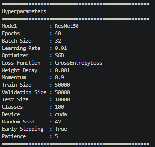
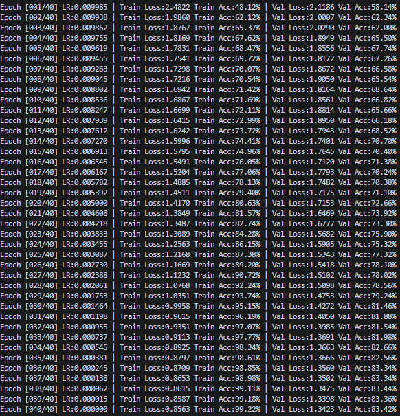
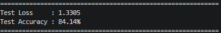
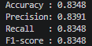

# resnet-study
### ResNet50 : test_1
torch.OutOfMemoryError: CUDA out of memory. Tried to allocate 50.00 MiB. GPU 0 has a total capacity of 9.64 GiB of which 22.12 MiB is free. Process 932170 has 6.88 GiB memory in use. Including non-PyTorch memory, this process has 2.60 GiB memory in use. Of the allocated memory 2.31 GiB is allocated by PyTorch, and 34.15 MiB is reserved by PyTorch but unallocated. If reserved but unallocated memory is large try setting PYTORCH_CUDA_ALLOC_CONF=expandable_segments:True to avoid fragmentation.  See documentation for Memory Management  (https://docs.pytorch.org/docs/stable/notes/cuda.html#optimizing-memory-usage-with-pytorch-cuda-alloc-conf)
- [fix] batch 128 → 32 : 위와 같은 오류 때문에 Batch size 수정하여 테스트 진행함
---

