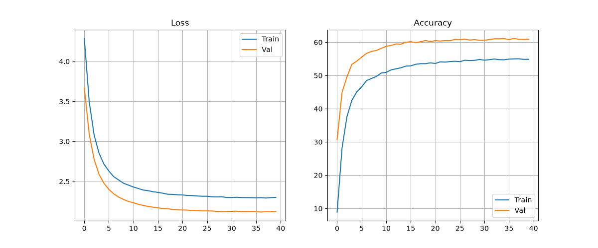
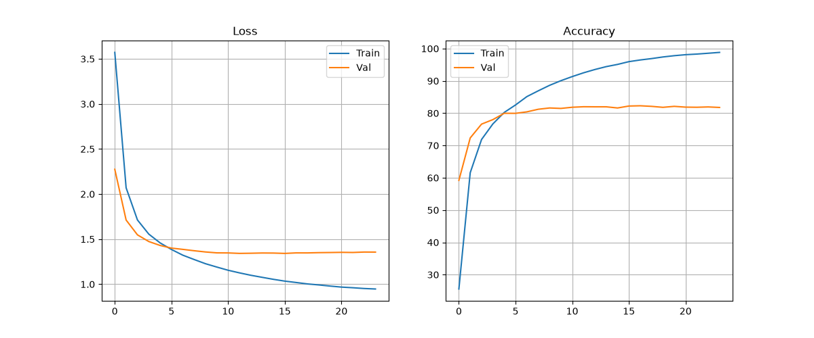
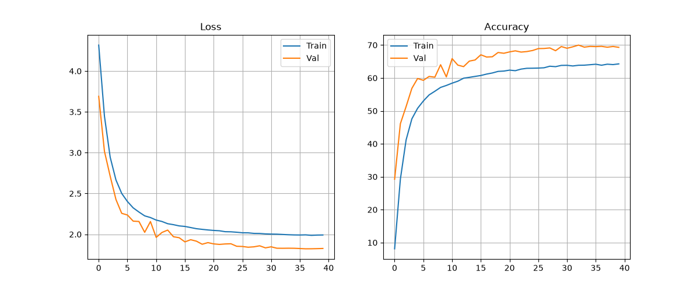
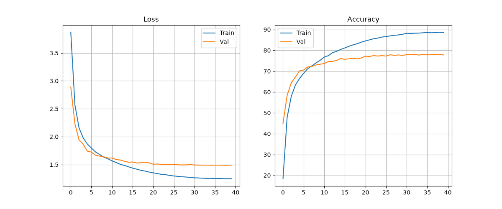
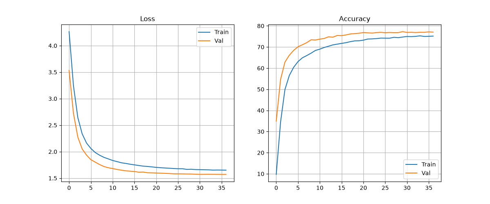
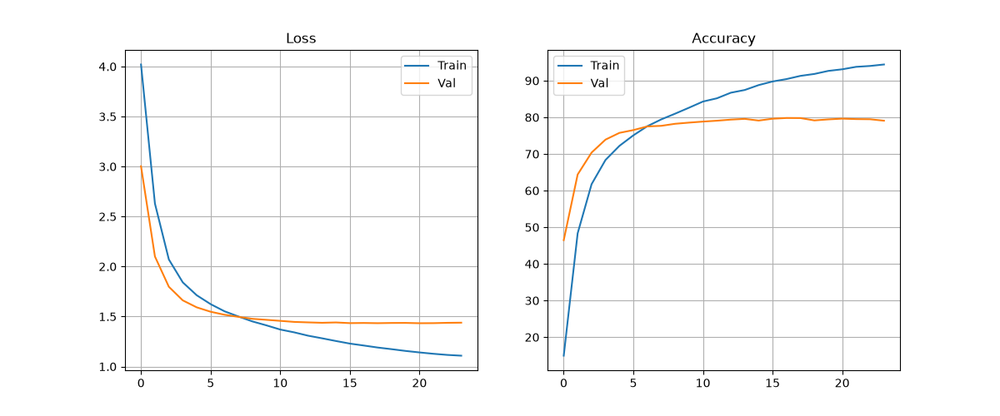
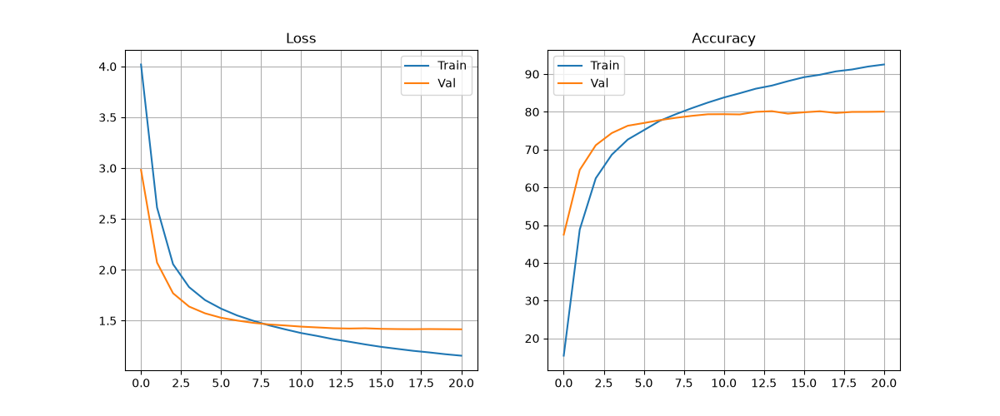
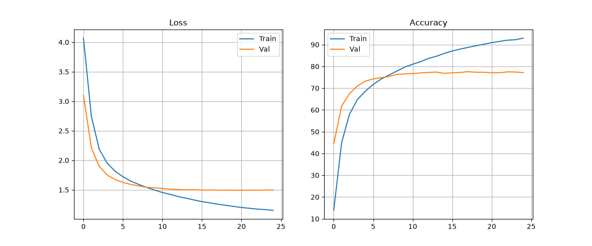
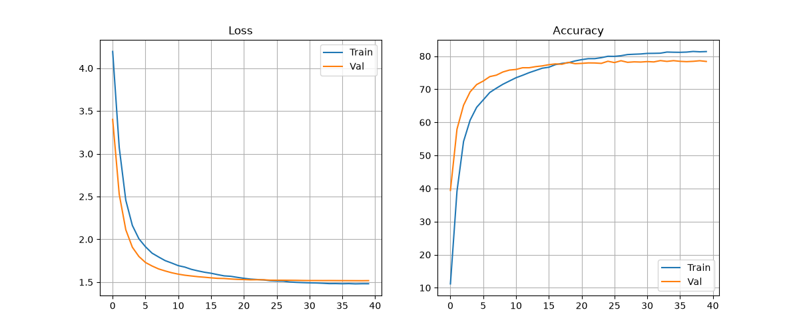

# 🧪 CIFAR-100 실험 히스토리 및 분석 리포트

> **총 실험 개수:** 10개 | **업데이트:** 2026-07-20 06:31

## 📊 전체 요약 (주요 변경점 위주)
| 실험 ID            |   정확도(%) | 주요 파라미터 변화   | 옵티마이저   |   학습률 |
|:-------------------|------------:|:---------------------|:-------------|---------:|
| 01_head_only       |       60.52 | -                    | sgd          |    0.001 |
| 02_full_tune       |       81.75 | freeze_level(1→63)   | sgd          |    0.001 |
| 03_stem_head       |       68.4  | freeze_level(1→33)   | sgd          |    0.001 |
| 04_stem_l4_head    |       77.49 | freeze_level(1→35)   | sgd          |    0.001 |
| 05_low_level_focus |       76.81 | freeze_level(1→49)   | sgd          |    0.001 |
| 06_mid_level_focus |       80.05 | freeze_level(1→13)   | sgd          |    0.001 |
| 07_sparse_tuning   |       80.41 | freeze_level(1→21)   | sgd          |    0.001 |
| 08_l3_isolation    |       77.66 | freeze_level(1→5)    | sgd          |    0.001 |
| 09_l2_isolation    |       77.83 | freeze_level(1→9)    | sgd          |    0.001 |
| 10_no_head_tune    |       81.75 | freeze_level(1→62)   | sgd          |    0.001 |

--- 

## 🔍 실험별 상세 분석
### 📍 실험 01_head_only
- **변경 사항:** 🚀 **Base Experiment (Standard)**
- **최종 성능:** Test Accuracy **60.52%** (Best Val: 61.14%)
- **세부 설정:** resnet34 | sgd | LR: 0.001 | BS: 128 | Freeze: 1

#### 📈 Learning Curves

---
### 📍 실험 02_full_tune
- **변경 사항:** **freeze_level**: 1 → 63
- **최종 성능:** Test Accuracy **81.75%** (Best Val: 82.30%)
- **세부 설정:** resnet34 | sgd | LR: 0.001 | BS: 128 | Freeze: 63

#### 📈 Learning Curves

---
### 📍 실험 03_stem_head
- **변경 사항:** **freeze_level**: 1 → 33
- **최종 성능:** Test Accuracy **68.40%** (Best Val: 69.98%)
- **세부 설정:** resnet34 | sgd | LR: 0.001 | BS: 128 | Freeze: 33

#### 📈 Learning Curves

---
### 📍 실험 04_stem_l4_head
- **변경 사항:** **freeze_level**: 1 → 35
- **최종 성능:** Test Accuracy **77.49%** (Best Val: 78.10%)
- **세부 설정:** resnet34 | sgd | LR: 0.001 | BS: 128 | Freeze: 35

#### 📈 Learning Curves

---
### 📍 실험 05_low_level_focus
- **변경 사항:** **freeze_level**: 1 → 49
- **최종 성능:** Test Accuracy **76.81%** (Best Val: 77.28%)
- **세부 설정:** resnet34 | sgd | LR: 0.001 | BS: 128 | Freeze: 49

#### 📈 Learning Curves

---
### 📍 실험 06_mid_level_focus
- **변경 사항:** **freeze_level**: 1 → 13
- **최종 성능:** Test Accuracy **80.05%** (Best Val: 79.82%)
- **세부 설정:** resnet34 | sgd | LR: 0.001 | BS: 128 | Freeze: 13

#### 📈 Learning Curves

---
### 📍 실험 07_sparse_tuning
- **변경 사항:** **freeze_level**: 1 → 21
- **최종 성능:** Test Accuracy **80.41%** (Best Val: 80.18%)
- **세부 설정:** resnet34 | sgd | LR: 0.001 | BS: 128 | Freeze: 21

#### 📈 Learning Curves

---
### 📍 실험 08_l3_isolation
- **변경 사항:** **freeze_level**: 1 → 5
- **최종 성능:** Test Accuracy **77.66%** (Best Val: 77.56%)
- **세부 설정:** resnet34 | sgd | LR: 0.001 | BS: 128 | Freeze: 5

#### 📈 Learning Curves

---
### 📍 실험 09_l2_isolation
- **변경 사항:** **freeze_level**: 1 → 9
- **최종 성능:** Test Accuracy **77.83%** (Best Val: 78.66%)
- **세부 설정:** resnet34 | sgd | LR: 0.001 | BS: 128 | Freeze: 9

#### 📈 Learning Curves

---
### 📍 실험 10_no_head_tune
- **변경 사항:** **freeze_level**: 1 → 62
- **최종 성능:** Test Accuracy **81.75%** (Best Val: 82.30%)
- **세부 설정:** resnet34 | sgd | LR: 0.001 | BS: 128 | Freeze: 62

#### 📈 Learning Curves

---
