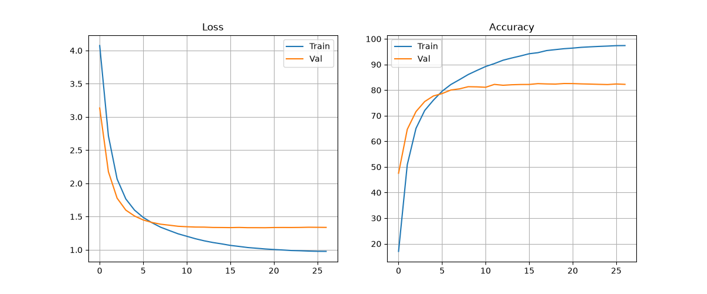
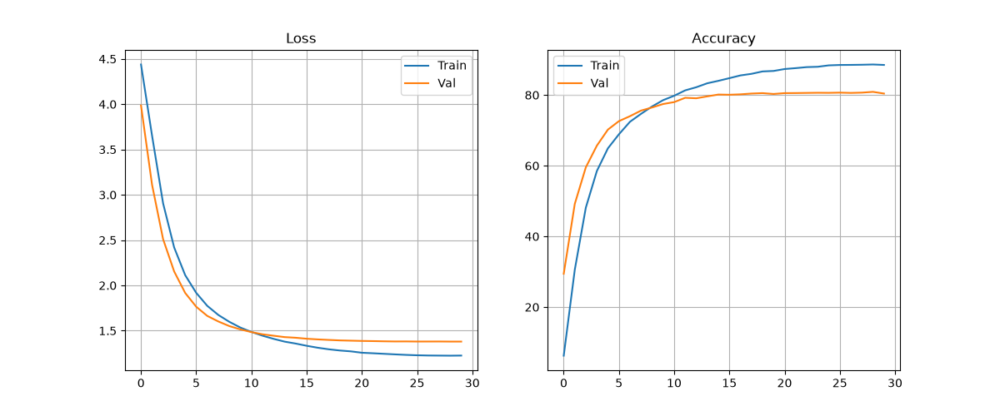
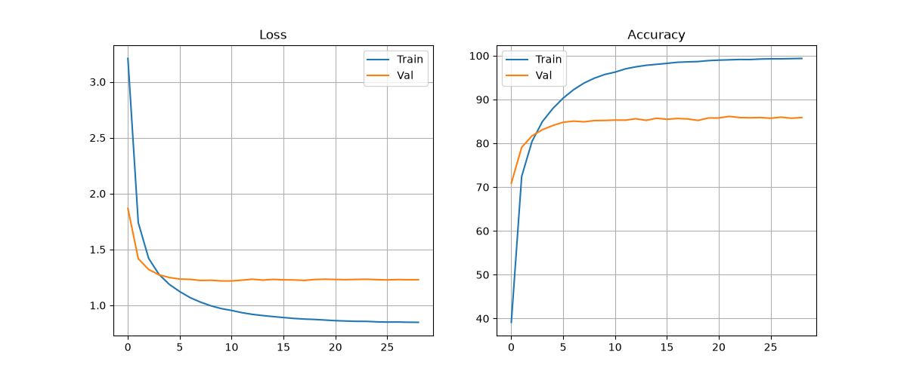
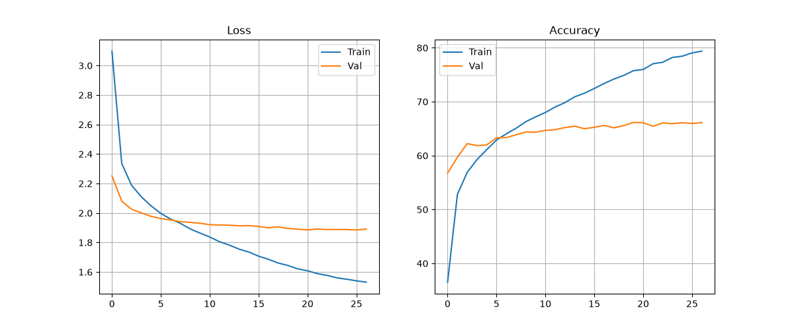
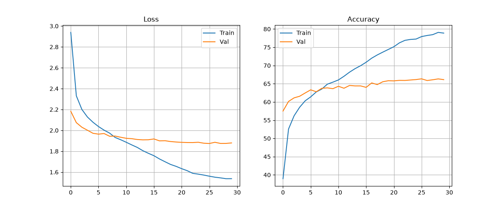
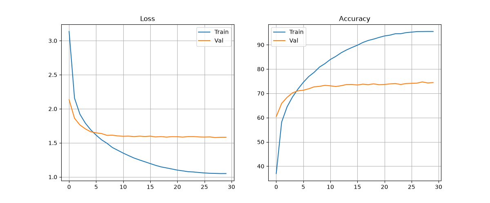
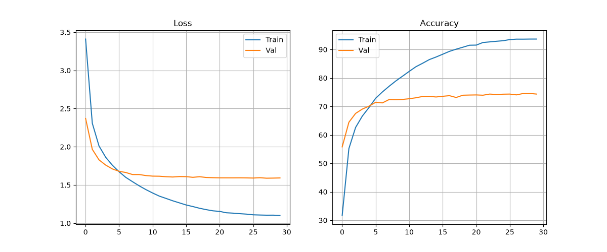
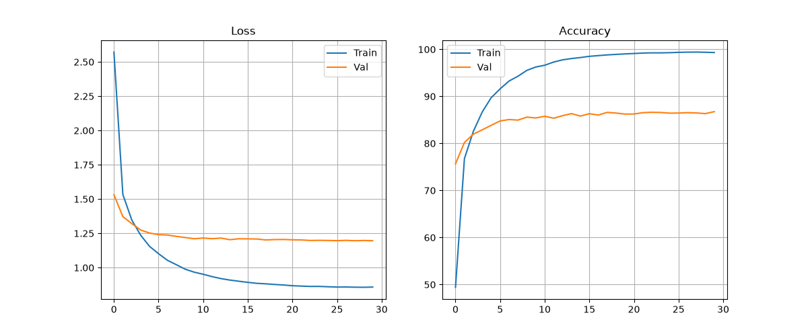

# 🧪 CIFAR-100 실험 히스토리 및 분석 리포트

```
head = nn.Sequential(
    nn.Linear(num_ftrs, 1024),
    nn.BatchNorm1d(1024),
    nn.ReLU(inplace=True),
    nn.Dropout(0.4),
    nn.Linear(1024, 512),
    nn.BatchNorm1d(512),
    nn.ReLU(inplace=True),
    nn.Dropout(0.25),
    nn.Linear(512, 100) # 마지막은 ReLU/Dropout 없이 마무리
)
```

> **총 실험 개수:** 8개 | **업데이트:** 2026-07-16 07:51

## 📊 전체 요약 (주요 변경점 위주)
| 실험 ID               |   정확도(%) | 주요 파라미터 변화                                                                                                      | 옵티마이저   |   학습률 |
|:----------------------|------------:|:------------------------------------------------------------------------------------------------------------------------|:-------------|---------:|
| 01_resnet34_base      |       81.99 | -                                                                                                                       | sgd          |   0.001  |
| 01_resnet34_base      |       80.35 | batch_size(128→256)                                                                                                     | sgd          |   0.001  |
| 02_efficientnet_base  |       85.74 | model(resnet34→efficientnet_b0)<br>optimizer(sgd→adam)<br>lr(0.001→0.0001)                                              | adam         |   0.0001 |
| 03_eff_freeze_head    |       64.1  | model(resnet34→efficientnet_b0)<br>optimizer(sgd→adam)<br>lr(0.001→0.0005)<br>freeze_level(63→1)<br>batch_size(128→256) | adam         |   0.0005 |
| 03_eff_freeze_head    |       64.92 | model(resnet34→efficientnet_b0)<br>optimizer(sgd→adam)<br>lr(0.001→0.0005)<br>freeze_level(63→1)                        | adam         |   0.0005 |
| 04_eff_freeze_partial |       74.81 | model(resnet34→efficientnet_b0)<br>optimizer(sgd→adam)<br>lr(0.001→0.0002)<br>freeze_level(63→3)                        | adam         |   0.0002 |
| 04_eff_freeze_partial |       73.97 | model(resnet34→efficientnet_b0)<br>optimizer(sgd→adam)<br>lr(0.001→0.0002)<br>freeze_level(63→3)<br>batch_size(128→256) | adam         |   0.0002 |
| 05_eff_sgd_test       |       86.57 | model(resnet34→efficientnet_b0)<br>lr(0.001→0.01)                                                                       | sgd          |   0.01   |

--- 

## 🔍 실험별 상세 분석
### 📍 실험 01_resnet34_base
- **변경 사항:** 🚀 **Base Experiment (Standard)**
- **최종 성능:** Test Accuracy **81.99%** (Best Val: 82.56%)
- **세부 설정:** resnet34 | sgd | LR: 0.001 | BS: 128 | Freeze: 63

#### 📈 Learning Curves


---
### 📍 실험 01_resnet34_base
- **변경 사항:** **batch_size**: 128 → 256
- **최종 성능:** Test Accuracy **80.35%** (Best Val: 80.90%)
- **세부 설정:** resnet34 | sgd | LR: 0.001 | BS: 256 | Freeze: 63

#### 📈 Learning Curves


---
### 📍 실험 02_efficientnet_base
- **변경 사항:** **model**: resnet34 → efficientnet_b0, **optimizer**: sgd → adam, **lr**: 0.001 → 0.0001
- **최종 성능:** Test Accuracy **85.74%** (Best Val: 86.14%)
- **세부 설정:** efficientnet_b0 | adam | LR: 0.0001 | BS: 128 | Freeze: 63

#### 📈 Learning Curves


---
### 📍 실험 03_eff_freeze_head
- **변경 사항:** **model**: resnet34 → efficientnet_b0, **optimizer**: sgd → adam, **lr**: 0.001 → 0.0005, **freeze_level**: 63 → 1, **batch_size**: 128 → 256
- **최종 성능:** Test Accuracy **64.10%** (Best Val: 66.16%)
- **세부 설정:** efficientnet_b0 | adam | LR: 0.0005 | BS: 256 | Freeze: 1

#### 📈 Learning Curves


---
### 📍 실험 03_eff_freeze_head
- **변경 사항:** **model**: resnet34 → efficientnet_b0, **optimizer**: sgd → adam, **lr**: 0.001 → 0.0005, **freeze_level**: 63 → 1
- **최종 성능:** Test Accuracy **64.92%** (Best Val: 66.34%)
- **세부 설정:** efficientnet_b0 | adam | LR: 0.0005 | BS: 128 | Freeze: 1

#### 📈 Learning Curves


---
### 📍 실험 04_eff_freeze_partial
- **변경 사항:** **model**: resnet34 → efficientnet_b0, **optimizer**: sgd → adam, **lr**: 0.001 → 0.0002, **freeze_level**: 63 → 3
- **최종 성능:** Test Accuracy **74.81%** (Best Val: 74.72%)
- **세부 설정:** efficientnet_b0 | adam | LR: 0.0002 | BS: 128 | Freeze: 3

#### 📈 Learning Curves


---
### 📍 실험 04_eff_freeze_partial
- **변경 사항:** **model**: resnet34 → efficientnet_b0, **optimizer**: sgd → adam, **lr**: 0.001 → 0.0002, **freeze_level**: 63 → 3, **batch_size**: 128 → 256
- **최종 성능:** Test Accuracy **73.97%** (Best Val: 74.56%)
- **세부 설정:** efficientnet_b0 | adam | LR: 0.0002 | BS: 256 | Freeze: 3

#### 📈 Learning Curves


---
### 📍 실험 05_eff_sgd_test
- **변경 사항:** **model**: resnet34 → efficientnet_b0, **lr**: 0.001 → 0.01
- **최종 성능:** Test Accuracy **86.57%** (Best Val: 86.76%)
- **세부 설정:** efficientnet_b0 | sgd | LR: 0.01 | BS: 128 | Freeze: 63

#### 📈 Learning Curves


---
