# 🧪 CIFAR-100 실험 히스토리 및 분석 리포트

> **총 실험 개수:** 19개 | **업데이트:** 2026-07-15 03:36

## 📊 전체 요약 (주요 변경점 위주)
| 실험 ID                |   정확도(%) | 주요 파라미터 변화                      | 옵티마이저   |   학습률 |
|:-----------------------|------------:|:----------------------------------------|:-------------|---------:|
| 01_baseline            |       81.75 | -                                       | sgd          |  0.001   |
| 02_high_lr             |       84.67 | lr(0.001→0.01)                          | sgd          |  0.01    |
| 02_high_lr             |       76.63 | lr(0.001→0.1)                           | sgd          |  0.1     |
| 03_adam_standard       |       83.91 | optimizer(sgd→adam) lr(0.001→0.0001) | adam         |  0.0001  |
| 03_low_lr              |       69.83 | lr(0.001→0.0001)                        | sgd          |  0.0001  |
| 04_freeze_fc           |       60.52 | freeze_level(63→1)                      | sgd          |  0.001   |
| 04_freeze_fc_only      |       59.57 | freeze_level(63→1)                      | sgd          |  0.001   |
| 05_freeze_partial      |       79.13 | freeze_level(63→7)                      | sgd          |  0.001   |
| 05_freeze_partial_deep |       79    | freeze_level(63→7)                      | sgd          |  0.001   |
| 06_freeze_bottom_up    |       68.4  | freeze_level(63→33)                     | sgd          |  0.001   |
| 06_optimizer_adam      |       84.09 | optimizer(sgd→adam) lr(0.001→0.0001) | adam         |  0.0001  |
| 07_high_dropout        |       81.98 | drop_out(0.3→0.5)                       | sgd          |  0.001   |
| 08_no_smoothing        |       82.21 | label_smoothing(0.1→0.0)                | sgd          |  0.001   |
| 09_heavy_wd            |       81.72 | weight_decay(0.0005→0.01)               | sgd          |  0.001   |
| 10_resnet18            |       80.21 | model(resnet34→resnet18)                | sgd          |  0.001   |
| 11_resnet50            |       83.14 | model(resnet34→resnet50)                | sgd          |  0.001   |
| 12_small_batch         |       82.21 | lr(0.001→0.00025) batch_size(128→32) | sgd          |  0.00025 |
| 13_large_batch         |       81.59 | lr(0.001→0.002) batch_size(128→256)  | sgd          |  0.002   |
| 14_no_momentum         |       73.81 | momentum(0.9→0.0)                       | sgd          |  0.001   |

--- 

## 🔍 실험별 상세 분석
### 📍 실험 01_baseline
- **변경 사항:** 🚀 **Base Experiment (Standard)**
- **최종 성능:** Test Accuracy **81.75%** (Best Val: 82.30%)
- **세부 설정:** resnet34 | sgd | LR: 0.001 | BS: 128 | Freeze: 63

#### 📈 Learning Curves
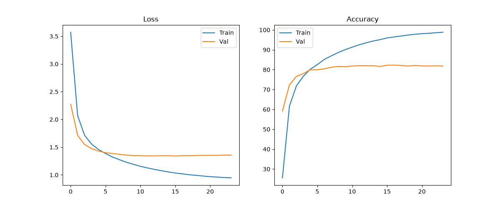

---
### 📍 실험 02_high_lr
- **변경 사항:** **lr**: 0.001 → 0.01
- **최종 성능:** Test Accuracy **84.67%** (Best Val: 85.46%)
- **세부 설정:** resnet34 | sgd | LR: 0.01 | BS: 128 | Freeze: 63

#### 📈 Learning Curves
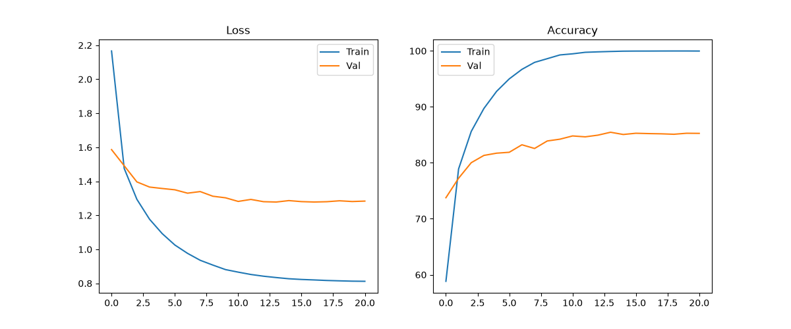

---
### 📍 실험 02_high_lr
- **변경 사항:** **lr**: 0.001 → 0.1
- **최종 성능:** Test Accuracy **76.63%** (Best Val: 77.64%)
- **세부 설정:** resnet34 | sgd | LR: 0.1 | BS: 128 | Freeze: 63

#### 📈 Learning Curves
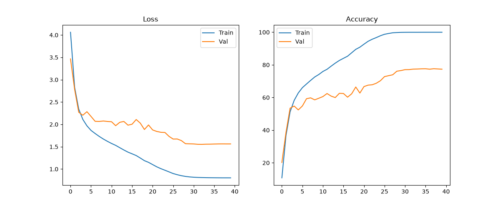

---
### 📍 실험 03_adam_standard
- **변경 사항:** **optimizer**: sgd → adam, **lr**: 0.001 → 0.0001
- **최종 성능:** Test Accuracy **83.91%** (Best Val: 84.98%)
- **세부 설정:** resnet34 | adam | LR: 0.0001 | BS: 128 | Freeze: 63

#### 📈 Learning Curves
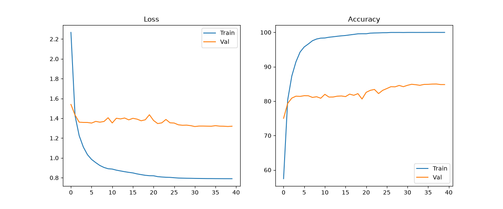

---
### 📍 실험 03_low_lr
- **변경 사항:** **lr**: 0.001 → 0.0001
- **최종 성능:** Test Accuracy **69.83%** (Best Val: 70.48%)
- **세부 설정:** resnet34 | sgd | LR: 0.0001 | BS: 128 | Freeze: 63

#### 📈 Learning Curves
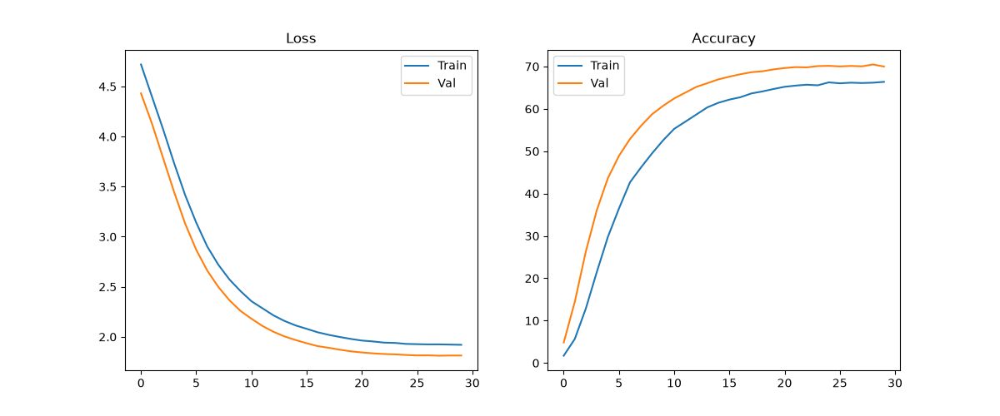

---
### 📍 실험 04_freeze_fc
- **변경 사항:** **freeze_level**: 63 → 1
- **최종 성능:** Test Accuracy **60.52%** (Best Val: 61.14%)
- **세부 설정:** resnet34 | sgd | LR: 0.001 | BS: 128 | Freeze: 1

#### 📈 Learning Curves
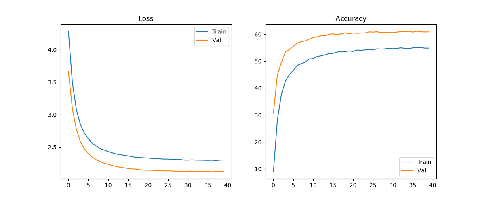

---
### 📍 실험 04_freeze_fc_only
- **변경 사항:** **freeze_level**: 63 → 1
- **최종 성능:** Test Accuracy **59.57%** (Best Val: 60.44%)
- **세부 설정:** resnet34 | sgd | LR: 0.001 | BS: 128 | Freeze: 1

#### 📈 Learning Curves
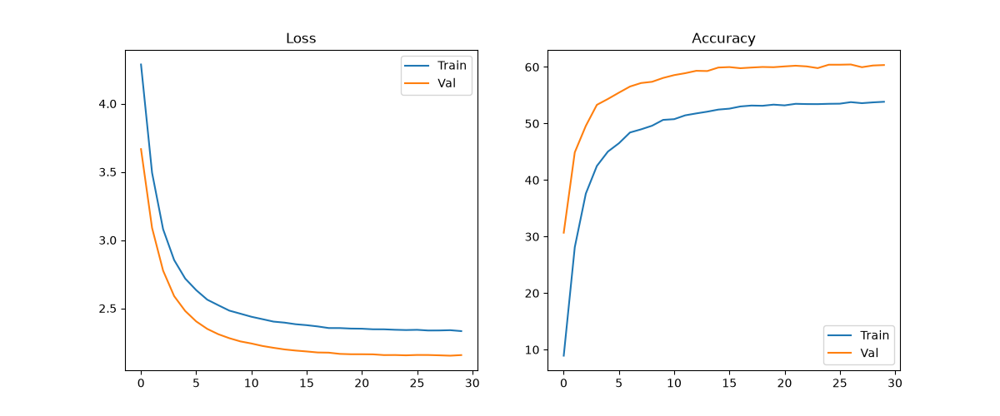

---
### 📍 실험 05_freeze_partial
- **변경 사항:** **freeze_level**: 63 → 7
- **최종 성능:** Test Accuracy **79.13%** (Best Val: 79.06%)
- **세부 설정:** resnet34 | sgd | LR: 0.001 | BS: 128 | Freeze: 7

#### 📈 Learning Curves
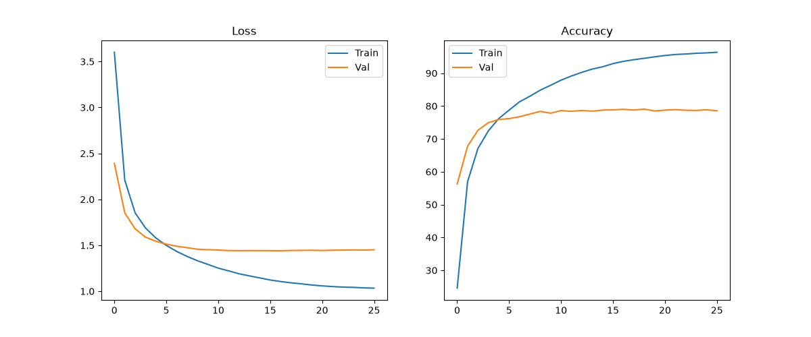

---
### 📍 실험 05_freeze_partial_deep
- **변경 사항:** **freeze_level**: 63 → 7
- **최종 성능:** Test Accuracy **79.00%** (Best Val: 79.22%)
- **세부 설정:** resnet34 | sgd | LR: 0.001 | BS: 128 | Freeze: 7

#### 📈 Learning Curves
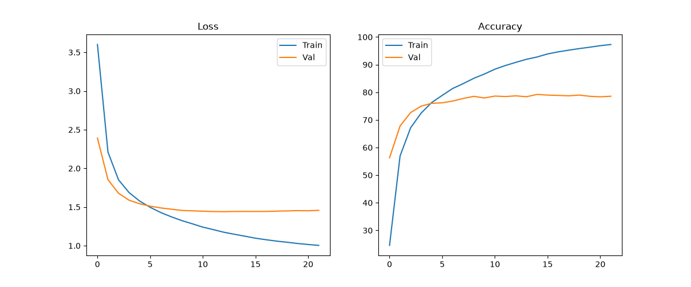

---
### 📍 실험 06_freeze_bottom_up
- **변경 사항:** **freeze_level**: 63 → 33
- **최종 성능:** Test Accuracy **68.40%** (Best Val: 69.98%)
- **세부 설정:** resnet34 | sgd | LR: 0.001 | BS: 128 | Freeze: 33

#### 📈 Learning Curves
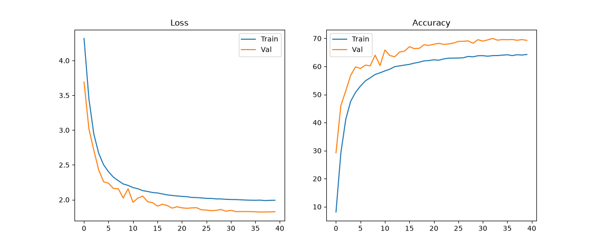

---
### 📍 실험 06_optimizer_adam
- **변경 사항:** **optimizer**: sgd → adam, **lr**: 0.001 → 0.0001
- **최종 성능:** Test Accuracy **84.09%** (Best Val: 85.02%)
- **세부 설정:** resnet34 | adam | LR: 0.0001 | BS: 128 | Freeze: 63

#### 📈 Learning Curves
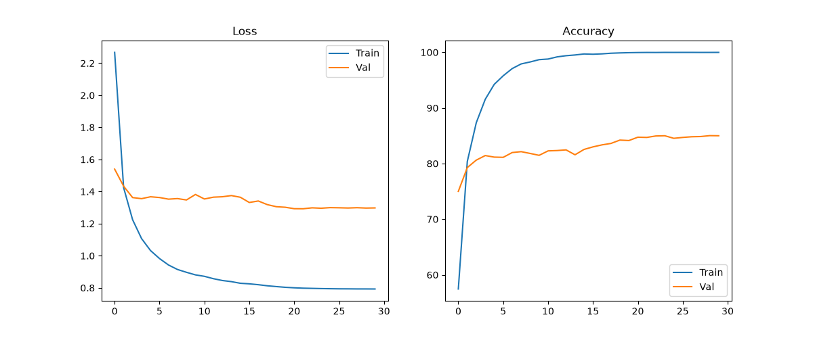

---
### 📍 실험 07_high_dropout
- **변경 사항:** **drop_out**: 0.3 → 0.5
- **최종 성능:** Test Accuracy **81.98%** (Best Val: 82.44%)
- **세부 설정:** resnet34 | sgd | LR: 0.001 | BS: 128 | Freeze: 63

#### 📈 Learning Curves
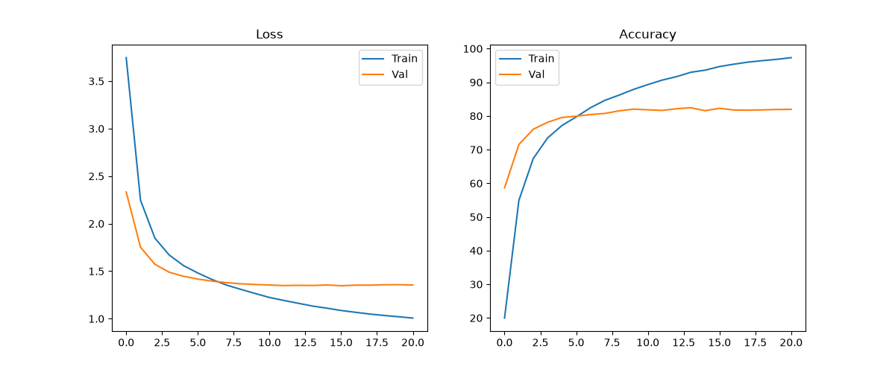

---
### 📍 실험 08_no_smoothing
- **변경 사항:** **label_smoothing**: 0.1 → 0.0
- **최종 성능:** Test Accuracy **82.21%** (Best Val: 82.50%)
- **세부 설정:** resnet34 | sgd | LR: 0.001 | BS: 128 | Freeze: 63

#### 📈 Learning Curves

---
### 📍 실험 09_heavy_wd
- **변경 사항:** **weight_decay**: 0.0005 → 0.01
- **최종 성능:** Test Accuracy **81.72%** (Best Val: 82.04%)
- **세부 설정:** resnet34 | sgd | LR: 0.001 | BS: 128 | Freeze: 63

#### 📈 Learning Curves
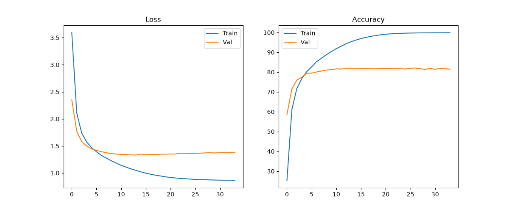

---
### 📍 실험 10_resnet18
- **변경 사항:** **model**: resnet34 → resnet18
- **최종 성능:** Test Accuracy **80.21%** (Best Val: 81.36%)
- **세부 설정:** resnet18 | sgd | LR: 0.001 | BS: 128 | Freeze: 63

#### 📈 Learning Curves
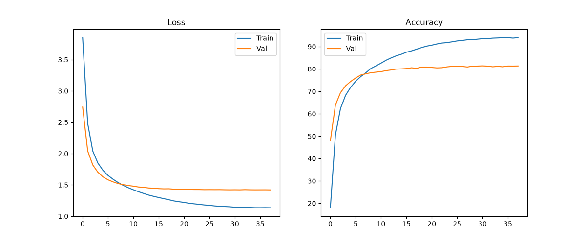

---
### 📍 실험 11_resnet50
- **변경 사항:** **model**: resnet34 → resnet50
- **최종 성능:** Test Accuracy **83.14%** (Best Val: 84.26%)
- **세부 설정:** resnet50 | sgd | LR: 0.001 | BS: 128 | Freeze: 63

#### 📈 Learning Curves
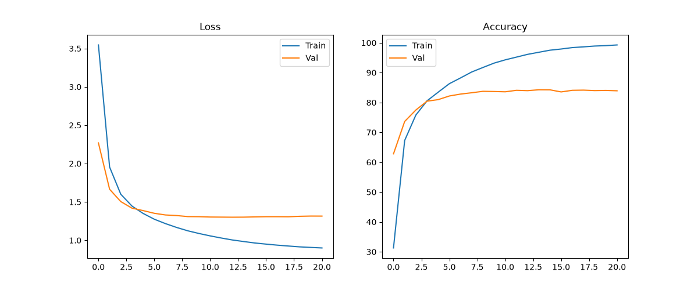

---
### 📍 실험 12_small_batch
- **변경 사항:** **lr**: 0.001 → 0.00025, **batch_size**: 128 → 32
- **최종 성능:** Test Accuracy **82.21%** (Best Val: 83.18%)
- **세부 설정:** resnet34 | sgd | LR: 0.00025 | BS: 32 | Freeze: 63

#### 📈 Learning Curves
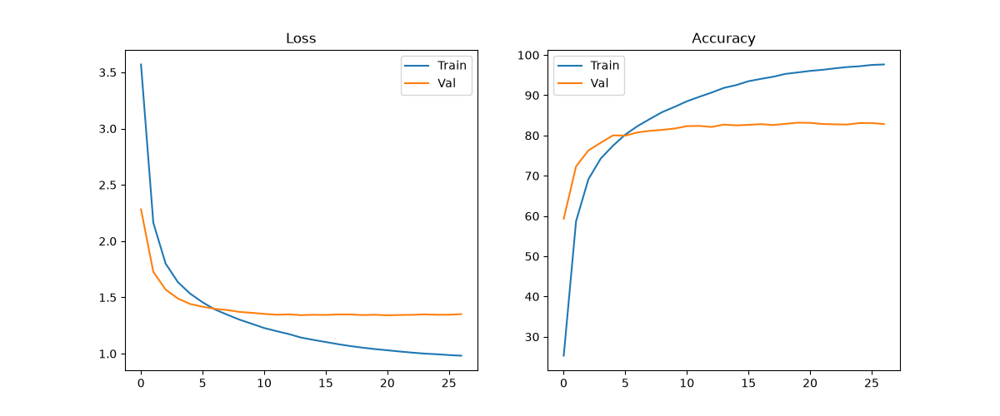

---
### 📍 실험 13_large_batch
- **변경 사항:** **lr**: 0.001 → 0.002, **batch_size**: 128 → 256
- **최종 성능:** Test Accuracy **81.59%** (Best Val: 82.54%)
- **세부 설정:** resnet34 | sgd | LR: 0.002 | BS: 256 | Freeze: 63

#### 📈 Learning Curves
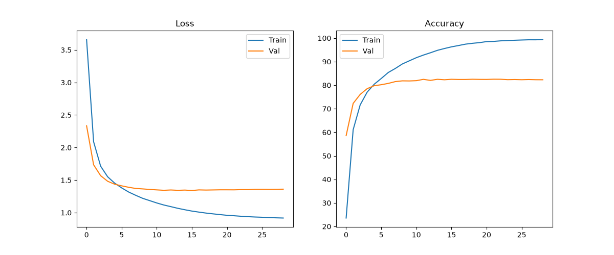

---
### 📍 실험 14_no_momentum
- **변경 사항:** **momentum**: 0.9 → 0.0
- **최종 성능:** Test Accuracy **73.81%** (Best Val: 74.30%)
- **세부 설정:** resnet34 | sgd | LR: 0.001 | BS: 128 | Freeze: 63

#### 📈 Learning Curves
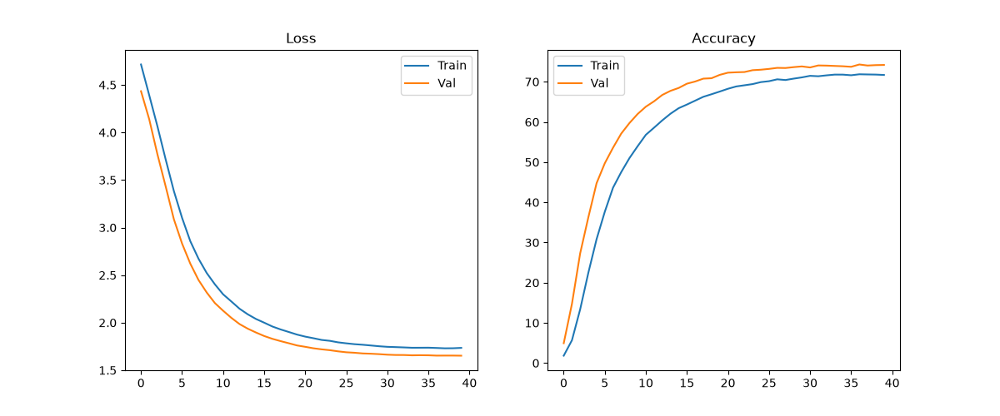

---
