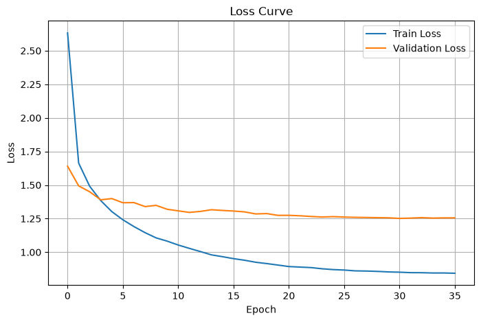
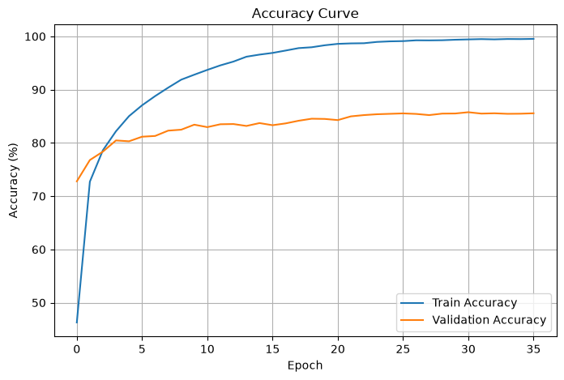

# resnet-study
<<<<<<< HEAD
### ResNet34 : test_2
- M : Batch size 128 → 32
=======
### ResNet34 : test_3
- U : Dropout(0.3)
- M : Batch Size = 256
>>>>>>> 640c3c8 (test : ResNet34 test_3)

<<<<<<< HEAD

=======

>>>>>>> 640c3c8 (test : ResNet34 test_3)
